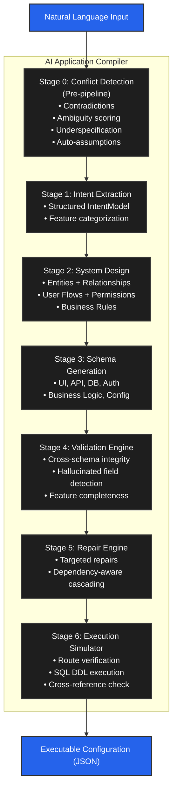

<div align="center">
  <h1>🤖 AI Application Compiler</h1>

  <p>
    <strong>Convert natural language product requirements into validated, executable application specifications.</strong>
  </p>

  <p>
    <a href="https://opensource.org/licenses/MIT">
      
    </a>
    <a href="https://www.python.org/">
      
    </a>
    <a href="https://nodejs.org/">
      
    </a>
  </p>
</div>

<hr>

A production-grade AI compiler that processes natural language prompts through a 7-stage pipeline to generate complete application schemas — UI, API, Database, Authentication, Business Logic, and Runtime Configuration — with conflict detection, cross-schema validation, hallucinated field detection, targeted repair, and execution simulation (including real DDL execution against PostgreSQL).

## 🏗️ Architecture



## 💻 Tech Stack

| Layer | Technology |
|---|---|
| **Frontend** | Next.js 15, TypeScript, TailwindCSS, Shadcn UI, Recharts |
| **Backend** | FastAPI, Python 3.9+ |
| **AI** | OpenAI API, Instructor, Pydantic (Structured Output) |
| **Validation** | Pydantic, JSON Schema, Rule-Based Engine |
| **Database** | PostgreSQL |
| **Metrics** | Prometheus-compatible |
| **Deployment** | Docker, Docker Compose |

## 🚀 Quick Start

### Prerequisites

- Python 3.9+
- Node.js 20+
- OpenAI API key (optional — runs in mock mode without one)

### 1. Clone & Setup

```bash
# Copy environment variables
cp .env.example .env
# Edit .env and add your OPENAI_API_KEY (optional)
```

### 2. Backend

```bash
cd backend
pip install -r requirements.txt
uvicorn src.main:app --reload --port 8000
```

### 3. Frontend

```bash
cd frontend
npm install
npm run dev
```

### 4. Docker (Full Stack)

```bash
docker-compose up --build
```

Visit:
- **Frontend**: http://localhost:3000
- **Backend API**: http://localhost:8000/docs
- **API Docs**: http://localhost:8000/redoc

## 📡 API Endpoints

| Method | Endpoint | Description |
|---|---|---|
| `POST` | `/api/generate` | Run full compilation pipeline |
| `POST` | `/api/clarify` | Analyze prompt for conflicts/ambiguity |
| `POST` | `/api/validate` | Re-validate existing compilation |
| `POST` | `/api/repair` | Run targeted repairs |
| `POST` | `/api/simulate` | Run execution simulation |
| `GET` | `/api/metrics` | Aggregate metrics |
| `GET` | `/api/cost-analysis` | Cost vs quality tradeoff analysis |
| `GET` | `/api/compilations` | List all compilations |
| `GET` | `/api/compilations/{id}` | Get specific compilation |
| `POST` | `/api/benchmarks/run` | Run benchmark suite |
| `GET` | `/api/benchmarks` | Get latest benchmark results |

## 📁 Project Structure

```text
CompileAI/
├── backend/
│   ├── src/
│   │   ├── pipeline/          # 7-stage compiler pipeline
│   │   │   ├── conflict_detector.py
│   │   │   ├── intent_extractor.py
│   │   │   ├── system_designer.py
│   │   │   ├── schema_generator.py
│   │   │   ├── validator.py
│   │   │   ├── repair_engine.py
│   │   │   └── execution_simulator.py
│   │   ├── schemas/           # Pydantic models (12 files)
│   │   ├── services/          # LLM + Compiler orchestration
│   │   ├── evaluation/        # Metrics + Benchmarks + Cost Analysis
│   │   └── api/               # FastAPI routes
│   └── tests/                 # Unit + Integration tests
├── frontend/
│   └── src/app/               # Next.js 15 App Router
│       ├── page.tsx           # Dashboard
│       ├── generator/         # Compilation interface
│       ├── validation/        # Validation logs
│       ├── repair/            # Repair timeline
│       ├── execution/         # Execution results
│       ├── benchmarks/        # Benchmark suite
│       └── metrics/           # Analytics dashboard
└── docker-compose.yml
```

## ⚙️ Deterministic Behavior

The compiler is designed for deterministic output:

- **Temperature = 0** for all LLM calls
- **Structured outputs** via Instructor + Pydantic
- **Schema-constrained decoding** — LLM must conform to exact Pydantic models
- **Stable prompt templates** — no dynamic prompt construction

Same input → Consistent output.

## 📊 Evaluation Framework

### Benchmark Suite

- **10 Real Product Prompts**: CRM, HRMS, Inventory, LMS, Ecommerce, Project Management, Healthcare, Social Media, Analytics, Booking
- **10 Edge Cases**: Conflicting requirements, minimal prompts, ambiguous requests, massive feature lists, multilingual, emoji

### Tracked Metrics

- Success Rate
- Validation Error Count
- Repair Operations
- Execution Pass Rate
- Average Latency
- Token Usage

## 🧪 Testing

```bash
cd backend
python -m pytest tests/ -v --cov=src --cov-report=term-missing
```

Tests cover:
- Schema validation (Pydantic model constraints)
- Pipeline stages (validator, repair engine, simulator)
- API endpoints (FastAPI TestClient)
- End-to-end compilation flow
- Conflict detection (7 test cases)
- Cost analysis (7 test cases)
- New endpoint integration (3 test cases)

**55 tests total, all passing.**

## 💰 Cost vs Quality Tradeoff

The compiler supports multiple LLM models with different cost/quality profiles:

| Model | Cost/Compile | Tokens | Latency | Quality |
|---|---|---|---|---|
| **GPT-4o** ✅ | ~$0.049 | 14,900 | ~12s | 95% |
| GPT-4o-mini | ~$0.005 | 14,900 | ~4s | 82% |
| GPT-4.1-nano | ~$0.004 | 14,900 | ~2.5s | 70% |

> **Design Decision:** We chose **GPT-4o as the default** because compiler correctness is paramount. Lower-quality models produce more validation errors, requiring more repair iterations. Validation and repair are rule-based (zero LLM cost), but higher base quality results in fewer repair iterations and more predictable output. At ~$0.05/compilation, GPT-4o is cost-effective for production use.

Access full analysis at `GET /api/cost-analysis`.

## 🛡️ Failure Handling

| Failure Type | How It's Handled |
|---|---|
| Vague prompt ("Build a dashboard") | Auto-assumptions generated + documented |
| Contradictory requirements | Conflict detection flags issues pre-pipeline |
| Underspecified input | Confidence scoring + clarification questions |
| Feature overload ("super app") | Overload warning + prioritization suggestion |
| Role conflicts | Pattern-based detection + resolution guidance |
| LLM hallucinated fields | Cross-reference check against architecture entities |
| Invalid JSON | Impossible — Instructor + Pydantic enforce schema |
| Missing keys | Pydantic required field validation |
| Schema mismatches | Cross-layer consistency checks in Stage 4 |

Call `POST /api/clarify` before `POST /api/generate` to analyze prompt quality.

## 📄 License

This project is licensed under the MIT License.

